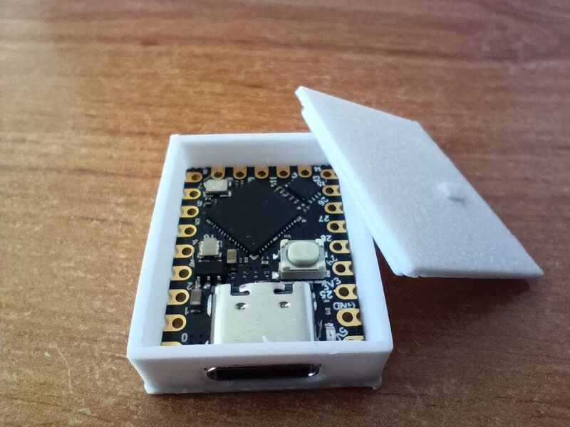
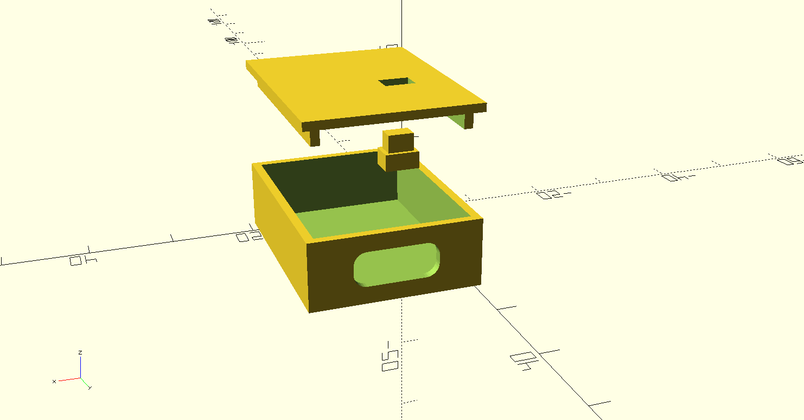

# snouse - Raspberry Pico Snooze Mouse
Keeps your computer awake with simulated mouse activity.



## Build & flash
```sh
$ cmake -S . -B build
$ cmake --build build
$ picotool load -f build/snouse.uf2
```

## Create custom trajectory
Run `./create_trajectory.py`, hold mouse button to record and then press escape to save trajectory into `./src/trajectory.h`.

## Build stl models


```sh
$ cmake -S . -B build && cmake --build build --target stls
```
Generated `.stls` are stored in `build/stls`.
